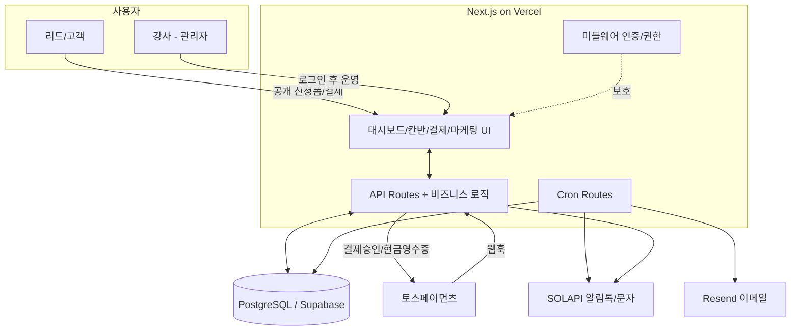
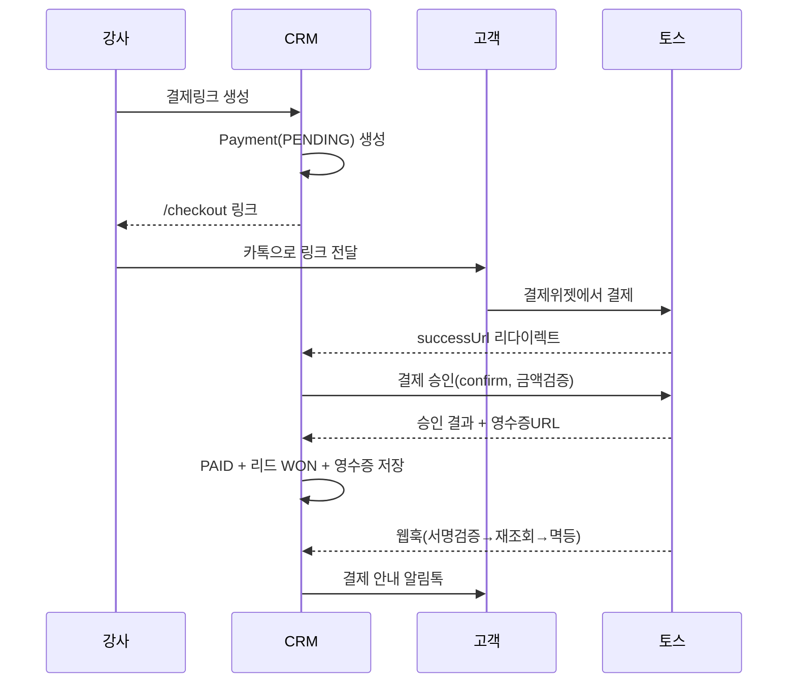
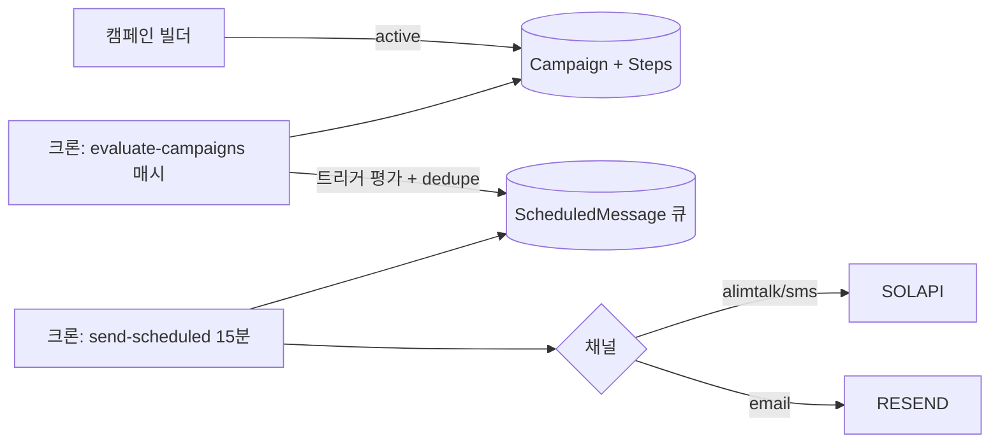
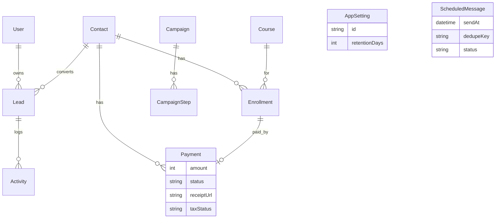

# 아키텍처

## 1. 시스템 구성

```mermaid
flowchart TB
  subgraph Client[사용자]
    L[리드/고객]
    A[강사 - 관리자]
  end

  subgraph Vercel[Next.js on Vercel]
    UI[대시보드/칸반/결제/마케팅 UI]
    API[API Routes + 비즈니스 로직]
    MW[미들웨어 인증/권한]
    CRON[Cron Routes]
  end

  DB[(PostgreSQL / Supabase)]
  TOSS[토스페이먼츠]
  SOLAPI[SOLAPI 알림톡/문자]
  RESEND[Resend 이메일]

  L -->|공개 신청폼/결제| UI
  A -->|로그인 후 운영| UI
  UI <--> API
  MW -.보호.-> UI
  API <--> DB
  API -->|결제승인/현금영수증| TOSS
  TOSS -->|웹훅| API
  CRON --> DB
  CRON --> SOLAPI
  CRON --> RESEND
  API --> SOLAPI
```

## 2. 결제 플로우

```mermaid
sequenceDiagram
  participant A as 강사
  participant CRM
  participant C as 고객
  participant T as 토스

  A->>CRM: 결제링크 생성
  CRM->>CRM: Payment(PENDING) 생성
  CRM-->>A: /checkout 링크
  A->>C: 카톡으로 링크 전달
  C->>T: 결제위젯에서 결제
  T-->>CRM: successUrl 리다이렉트
  CRM->>T: 결제 승인(confirm, 금액검증)
  T-->>CRM: 승인 결과 + 영수증URL
  CRM->>CRM: PAID + 리드 WON + 영수증 저장
  T-->>CRM: 웹훅(서명검증→재조회→멱등)
  CRM->>C: 결제 안내 알림톡
```

## 3. 마케팅 캠페인 플로우

```mermaid
flowchart LR
  CB[캠페인 빌더] -->|active| CMP[(Campaign + Steps)]
  EV[크론: evaluate-campaigns 매시] --> CMP
  EV -->|트리거 평가 + dedupe| Q[(ScheduledMessage 큐)]
  SD[크론: send-scheduled 15분] --> Q
  SD --> CH{채널}
  CH -->|alimtalk/sms| SOLAPI
  CH -->|email| RESEND
```

## 4. 데이터 모델 (ER)

```mermaid
erDiagram
  User ||--o{ Lead : owns
  Contact ||--o{ Lead : converts
  Contact ||--o{ Enrollment : has
  Contact ||--o{ Payment : has
  Course ||--o{ Enrollment : for
  Enrollment ||--o| Payment : paid_by
  Lead ||--o{ Activity : logs
  Campaign ||--o{ CampaignStep : has
  AppSetting {
    string id
    int retentionDays
  }
  Payment {
    int amount
    string status
    string receiptUrl
    string taxStatus
  }
  ScheduledMessage {
    datetime sendAt
    string dedupeKey
    string status
  }
```
